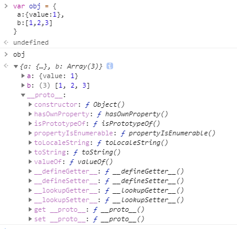
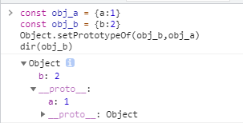
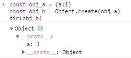
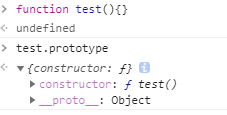

## 1、原型

### 1.1 prototype 定义

1. **原型是指为其它对象提供共享属性访问的对象**。
2. 在创建对象时，每个对象都包含一个隐式引用指向它的原型对象或者 null。



obj隐式的挂载了另一个对象的引用，置于`__proto__`属性中

### 1.2 历史问题：`__proto__`

ECMAScript 规范描述 prototype 是一个隐式引用，但之前的一些浏览器，已经私自实现了 `__proto__` 这个属性，使得可以通过 `obj.__proto__` 这个显式的属性访问，访问到被定义为隐式属性的 prototype。

1. `Object.getPrototypeOf(obj)` 间接访问指定对象的 prototype 对象
2. `Object.setPrototypeOf(obj, anotherObj)` 间接设置指定对象的 prototype 对象
3. 部分浏览器提前开了 `__proto__` 的口子，使得可以通过 `obj.__proto__` 直接访问原型，通过 `obj.__proto__` = anotherObj 直接设置原型
4. ECMAScript 2015 规范只好向事实低头，将 __proto__ 属性纳入了规范的一部分

`__proto__` 属性既不能被 for in 遍历出来，也不能被 Object.keys(obj) 查找出来。访问对象的 `obj.__proto__` 属性，默认走的是 Object.prototype 对象上 `__proto__` 属性的 get/set 方法。

## 2、原型链

1. 原型也是对象，因此它也有自己的原型，这样构成一个原型链。
2. 原型链的终点是 `null`
3. 原型链的作用：在访问一个对象的属性时，实际上是在查询原型链。这个对象是原型链的第一个元素，先检查它是否包含属性名，如果包含则返回属性值，否则检查原型链上的第二个元素，以此类推。

## 3、关联原型

### 3.1 两类原型继承方式

1. 原型继承，就是指设置某个对象为另一个对象的原型。
2. 在 JavaScript 中，有两类原型继承的方式：**显式继承**和**隐式继承**。
3. 显式跟隐式的差别：是否由开发者亲自操作。

#### 3.2.1 显示原型继承

1. 通过调用 `Object.setPrototypeOf` 设置原型



2. 通过调用 `Object.create` 方法，直接继承另一个对象



3. 两者差别在于：

 - `Object.setPropertyOf`，给我两个对象，我把其中一个设置为另一个的原型。
 - `Object.create`，给我一个对象，它将作为我创建的新对象的原型。

#### 3.2.2 隐式原型继承

**通过 constructor 构造函数，在使用 new 关键字实例化时，会自动继承 constructor 的 prototype 对象，作为实例的原型。**

---

***思考 1：*** 假设没有隐式原型继承，创建一个普通的js对象如何实现？

1. 创建一个空对象
2. 设置该对象的原型为另一个对象或者`null`
3. 填充该对象，增加属性或方法

```
// create
const obj = {}

// linking
Object.setPrototypeOf(obj,Object.prototype)

// initilize
obj.firstname = 'Jade'
obj.lastname = 'Gu'
```
显而易见这个过程比较繁琐

***思考 2：*** 如何让用户无感知的完成创建对象、原型继承和属性初始化的过程？

**设计方案：**

1. 某些函数称为 `constructor`，专门做属性初始化
```
  funciton User(firstname, lastname){
    this.firstname = firstname
    this.lastname = lastname
  }
```
2. 约定 `constructor` 函数，有一个特殊属性 `prototype`

```
  User.prototype = Object.create(Object.prototype)
```
3. 用户使用 `new` 关键字，创建对象

```
  const user = new User('Jade', 'Gu')
```
此时，`new` 的过程在内部替我们做了创建空对象的操作，我们由最初的3件事变成了2件事。

**问题：** 我们是否可以将3件事变为只做1件事？

**改进方案：** 让所有函数，都有 `prototype` 属性，它默认是以 `Object.prototype` 为原型的对象。

**结果：** 这样用户通常只需要编写 constructor 函数，描述如何初始化对象的属性即可。



**普通函数创建时，自带了 prototype 属性，该属性是一个对象，包含 constructor 一个字段，指向构造函数。**

### 3.2 内置的构造函数和语法糖

JavaScript 的主流继承方式，选择了隐式原型继承，它提供了几个内置的 constructor 函数，如 Object, Array, Boolean, String, Number 等。

```
const user = new Object()
user.firstname = 'Jade'
user.lastname = 'Gu'
```
等价于：
```
const user = {
  firstname: 'Jade',
  lastname: 'Gu'
}
```
`对象字面量` 等价于前面 `new Object` 再挂载属性的过程。

```
var array = [1,2]
```
同理，数组字面量，就是 new Array() 后再填充数据的语法糖。

当我们使用对象字面量创建一个新对象时，它有两层隐式行为。

1）隐式的通过 new Object() 去创建对象

2）隐式的进行原型继承

---

1. `constructor` 是一个函数，而所有函数都是 `new Function` 创建出来的，函数字面量可以看作是它的语法糖。
2. 函数也是对象，也有自己的隐式引用（原型）。但函数的 prototype 属性，却不是该函数对象的原型。而是基于前面介绍的隐式原型继承规则，作为原型，挂载到 new F() 创建出来的新对象内部。