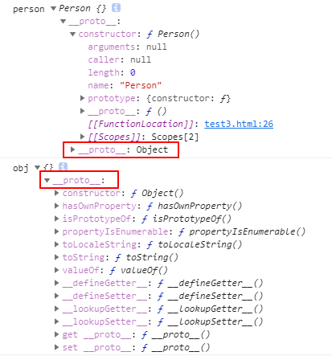

**定义：** new 运算符创建一个用户定义的对象类型的实例或具有构造函数的内置对象的实例。 ——（来自于MDN）

## 1 new 实例化过程做了什么？

### 1.1 栗子1

```
function Person(){}
const person = new Person()
console.log('person',person)

const obj = new Object()
console.log('obj',obj)
```



1. `new` 创建了一个全新的对象
2. 这个对象会被执行 `__proto__`链接

### 1.2 栗子2

```
function Person(name){
    console.log('赋值前-this',this) // Person {}
    this.name = name
    console.log('赋值后-this',this) // Person {name: "剑"}
}
const person = new Person('剑') 
console.log(person) // Person {name: "剑"}
```
生成的新对象会绑定到函数调用的 `this`

### 1.3 栗子3

```
function Person(name){
    this.name = name
}
Person.prototype.doSth = function(){
    console.log(this.name)
}
const person1 = new Person('红') 
const person2 = new Person('明')

// __proto__ 是浏览器实现的查看原型方案。
person1.__proto__ === Person.prototype; // true
person2.__proto__ === Person.prototype; // true

// 用ES5 则是：
Object.getPrototypeOf(person1) === Person.prototype; // true
Object.getPrototypeOf(person2) === Person.prototype; // true
```
通过 `new` 创建的每个对象将最终被 `__proto__` 链接到这个函数的 `prototype` 对象上。

### 1.4 栗子4

```
function Person(name){
    this.name = name
    // Null（空） null
    // Undefined（未定义） undefined
    // Number（数字） 1
    // String（字符串）'1'
    // Boolean（布尔） true
    // Symbol（符号）（第六版新增） symbol

    // Object（对象） {}
    // Function（函数） function(){}
    // Array（数组） []
    // Date（日期） new Date()
    // RegExp（正则表达式）/a/
    // Error （错误） new Error()
}
const person = new Person('剑') 
console.log(person)
```

如果函数没有返回对象类型`Object`(包含`Functoin`, `Array`, `Date`, `RegExg`, `Error`)，那么 `new` 表达式中的函数调用会自动返回这个新的对象。

### 1.5 小结

1. `new` 创建了一个全新的对象
2. 这个对象会被执行 `__proto__`链接
3. 生成的新对象会绑定到函数调用的 `this`
4. 通过 `new` 创建的每个对象将最终被 `__proto__` 链接到这个函数的 `prototype` 对象上。
5. 如果函数没有返回对象类型`Object`(包含`Functoin`, `Array`, `Date`, `RegExg`, `Error`)，那么 `new` 表达式中的函数调用会自动返回这个新的对象。

## 2 new 模拟实现第一版

```
/**
 * 模拟实现 new 操作符
 * @param  {Function} ctor [构造函数]
 * @return {Object|Function|Regex|Date|Error}      [返回结果]
 */
function newOperator(ctor){
    if(typeof ctor !== 'function'){
      throw 'newOperator function the first param must be a function';
    }
    // ES6 new.target 是指向构造函数
    newOperator.target = ctor;
    // 1.创建一个全新的对象，
    // 2.并且执行[[Prototype]]链接
    // 4.通过`new`创建的每个对象将最终被`[[Prototype]]`链接到这个函数的`prototype`对象上。
    var newObj = Object.create(ctor.prototype);
    // ES5 arguments转成数组 当然也可以用ES6 [...arguments], Array.from(arguments);
    // 除去ctor构造函数的其余参数
    var argsArr = [].slice.call(arguments, 1);
    // 3.生成的新对象会绑定到函数调用的`this`。
    // 获取到ctor函数返回结果
    var ctorReturnResult = ctor.apply(newObj, argsArr);
    // 小结4 中这些类型中合并起来只有Object和Function两种类型 typeof null 也是'object'所以要不等于null，排除null
    var isObject = typeof ctorReturnResult === 'object' && ctorReturnResult !== null;
    var isFunction = typeof ctorReturnResult === 'function';
    if(isObject || isFunction){
        return ctorReturnResult;
    }
    // 5.如果函数没有返回对象类型`Object`(包含`Functoin`, `Array`, `Date`, `RegExg`, `Error`)，那么`new`表达式中的函数调用会自动返回这个新的对象。
    return newObj;
}
```

## 3 new 模拟实现第二版

```
const isComplexDataType = obj => (typeof obj === 'Object' || typeof obj === 'function') && obj !== null
function objectFactory(){
    const obj = new Object()
    const Constructor = [].shift.call(arguments)
    obj.__proto__ = Constructor.prototype
    const ret = Constructor.apply(obj, arguments);
    return isComplexDataType(ret) ? ret : obj
}
```
1. new Object() 创建新对象，且建立`__proto__`链接
2. 取出构造函数 `Constructor`，且让新对象的原型指向构造函数的 `prototype`（这样新对象可以访问到构造函数原型中的属性）
3. `apply` 改变构造函数 `this` 的指向到新对象（这样新对象可以访问到构造函数中的属性）
4. 若函数没有返回`Object`类型，则返回新对象

## 4 new 模拟实现第三版

```
const isComplexDataType = obj => (typeof obj === 'Object' || typeof obj === 'function') && obj !== null
function _new(){
    const Constructor = [].shift.call(arguments)
    const obj = Object.create(Constructor.prototype)
    const ret = Constructor.apply(obj, arguments);
    return isComplexDataType(ret) ? ret : obj
}
```
1. 获得构造函数，同时删除 arguments 中第一个参数
2. 创建一个新对象且建立链接到原型，obj可以访问构造函数原型中的属性
3. 绑定 `this` 实现继承，obj可以访问到构造函数中的属性
4. 优先返回构造函数返回的对象