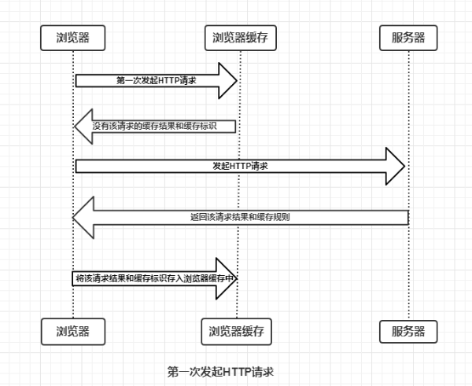

## 1 浏览器第一次发起HTTP请求

浏览器与服务器通信的方式为应答模式，即是：**浏览器发起HTTP请求 – 服务器响应该请求**。那么浏览器第一次向服务器发起该请求后拿到请求结果，会根据响应报文中HTTP头的缓存标识，决定是否缓存结果，是则将请求结果和缓存标识存入浏览器缓存中，简单过程如下图：

浏览器缓存机制的关键:

1. 浏览器每次发起请求，都会先在浏览器缓存中查找该请求的结果以及缓存标识
2. 浏览器每次拿到返回的请求结果都会将该结果和缓存标识存入浏览器缓存中

是否需要向服务器重新发起HTTP请求将缓存过程分为两个部分，分别是强制缓存和协商缓存 。

## 2 强制缓存

**强制缓存就是向浏览器缓存查找该请求结果，并根据该结果的缓存规则来决定是否使用该缓存结果的过程**

强制缓存的情况分为三种：

1. 不存在该缓存结果和缓存标识，强制缓存失效，则直接向服务器发起请求（跟第一次发起请求一致）
2. 存在该缓存结果和缓存标识，但是结果已经失效，强制缓存失效，则使用协商缓存
3. 存在该缓存结果和缓存标识，且该结果没有还没有失效，强制缓存生效，直接返回该结果

**思考：** 那么强制缓存的缓存规则是什么？

当浏览器向服务器发送请求的时候，服务器会将缓存规则放入HTTP响应的报文的HTTP头中和请求结果一起返回给浏览器，**控制强制缓存的字段分别是Expires和Cache-Control**，其中Cache-Conctrol的优先级比Expires高。

### 2.1 Expires

Expires是HTTP/1.0控制网页缓存的字段，其值为服务器返回该请求的结果缓存的到期时间，即再次发送请求时，如果客户端的时间小于Expires的值时，直接使用缓存结果。

**思考1：** Expires是HTTP/1.0的字段，但是现在浏览器的默认使用的是HTTP/1.1，那么在HTTP/1.1中网页缓存还是否由Expires控制？

到了HTTP/1.1，Expires已经被Cache-Control替代，原因在于Expires控制缓存的原理是**使用客户端的时间与服务端返回的时间做对比**，如果客户端与服务端的时间由于某些原因（时区不同；客户端和服务端有一方的时间不准确）发生误差，那么强制缓存直接失效，那么强制缓存存在的意义就毫无意义。

**思考2：** 那么Cache-Control又是如何进行控制的？

### 2.2 Cache-Control

在HTTP/1.1中，Cache-Control是最重要的规则，主要用于控制网页缓存，主要取值为：

- public：所有内容都将被缓存（客户端和代理服务器都可缓存）
- private：所有内容只有客户端可以缓存，Cache-Control的默认取值
- no-cache：客户端缓存内容，但是是否使用缓存则需要经过协商缓存来验证决定
- no-store：所有内容都不会被缓存，即不使用强制缓存，也不使用协商缓存
- max-age=xxx (xxx is numeric)：缓存内容将在xxx秒后失效

**思考3：** 浏览器的缓存存放在哪里，如何在浏览器中判断强制缓存是否生效？

缓存存放的位置，分别为**from memory cache** 和 **from disk cache**。from memory cache代表使用内存中的缓存，from disk cache则代表使用的是硬盘中的缓存，浏览器读取缓存的顺序为memory –> disk。

### 2.3 内存缓存(from memory cache)

两个特点：

1. **快速读取**：内存缓存会将编译解析后的文件，直接存入该进程的内存中，占据该进程一定的内存资源，以方便下次运行使用时的快速读取。
2. **时效性**：一旦该进程关闭，则该进程的内存则会清空。

### 2.4 硬盘缓存(from disk cache)

硬盘缓存则是直接将缓存写入硬盘文件中，读取缓存需要对该缓存存放的硬盘文件进行I/O操作，然后重新解析该缓存内容，读取复杂，速度比内存缓存慢。

---

常识：在浏览器中，浏览器会在js和图片等文件解析执行后直接存入内存缓存中，那么当刷新页面时只需直接从内存缓存中读取(from memory cache)；而css文件则会存入硬盘文件中，所以每次渲染页面都需要从硬盘读取缓存(from disk cache)。

## 3 协商缓存

**协商缓存就是强制缓存失效后，浏览器携带缓存标识向服务器发起请求，由服务器根据缓存标识决定是否使用缓存的过程**

协商缓存的情况分为两种：

1. 协商缓存生效，返回304，代表该资源无更新
2. 协商缓存失败，返回200和请求结果，代表该资源更新了

控制协商缓存的字段分别有：Last-Modified / If-Modified-Since和Etag / If-None-Match，其中Etag / If-None-Match的优先级比Last-Modified / If-Modified-Since高。

### 3.1 Last-Modified / If-Modified-Since

- Last-Modified是服务器响应请求时，返回该资源文件在服务器最后被修改的时间
- If-Modified-Since则是客户端再次发起该请求时，携带上次请求返回的Last-Modified值，通过此字段值告诉服务器该资源上次请求返回的最后被修改时间。服务器收到该请求，发现请求头含有If-Modified-Since字段，则会根据If-Modified-Since的字段值与该资源在服务器的最后被修改时间做对比，若服务器的资源最后被修改时间大于If-Modified-Since的字段值，则重新返回资源，状态码为200；否则则返回304，代表资源无更新，可继续使用缓存文件

### 3.1 Etag / If-None-Match

- Etag是服务器响应请求时，返回当前资源文件的一个唯一标识(由服务器生成)
- If-None-Match是客户端再次发起该请求时，携带上次请求返回的唯一标识Etag值，通过此字段值告诉服务器该资源上次请求返回的唯一标识值。服务器收到该请求后，发现该请求头中含有If-None-Match，则会根据If-None-Match的字段值与该资源在服务器的Etag值做对比，一致则返回304，代表资源无更新，继续使用缓存文件；不一致则重新返回资源文件，状态码为200

## 4 总结

强制缓存优先于协商缓存进行，若强制缓存(Expires和Cache-Control)生效则直接使用缓存，若不生效则进行协商缓存(Last-Modified / If-Modified-Since和Etag / If-None-Match)，协商缓存由服务器决定是否使用缓存，若协商缓存失效，那么代表该请求的缓存失效，重新获取请求结果，再存入浏览器缓存中；生效则返回304，继续使用缓存，主要过程如下：

::: tip 参考文章
[彻底理解浏览器的缓存机制（http缓存机制）](https://www.cnblogs.com/chengxs/p/10396066.html)
:::
