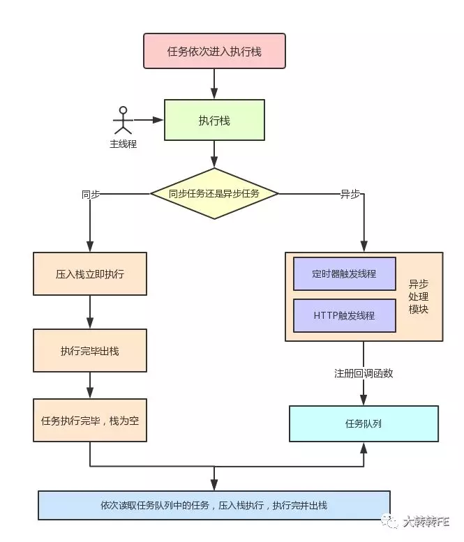
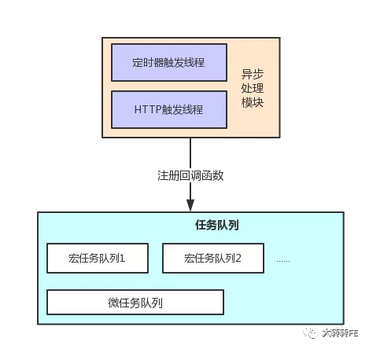

## 1 同步任务和异步任务

**同步任务**：即可以立即执行的任务，例如 `console.log()` 打印一条日志、声明一个变量或者执行一次加法操作等。

**异步任务**：相反不会立即执行的事件任务。异步任务包括**宏任务**和**微任务**

常见的异步操作：

- Ajax
- DOM的事件操作
- setTimeout
- Promise的then方法
- Node的读取文件

#### 同步任务与异步任务的执行流程：

- 异步任务完成注册后会将回调函数加入任务队列等待主线程执行。
- 执行栈中的同步任务执行完毕后，会查看并读取任务队列中的事件函数，于是任务队列的函数结束等待状态，进入执行栈，开始执行。

## 2 宏任务和微任务

异步任务分为宏任务和微任务，宏任务队列可以有多个，微任务队列只有一个。

::: tip 宏任务（macrotask）
script(全局任务)， setTimeout， setInterval， setImmediate， I/O， UI rendering
:::

::: tip 微任务（microtask）
process.nextTick， Promise.then()， Object.observe， MutationObserver
:::

注意：微任务中 process.nextTick 优先级高于Promise

## 3 异步任务进入任务队列

当一个异步任务入栈时，主线程判断该任务为异步任务，并把该任务交给异步处理模块处理，当异步处理模块处理完达到触发条件时，根据任务的类型，将回调函数压入任务队列。

- 如果是宏任务，则新增一个宏任务队列，任务队列中的宏任务可以有多个来源。
- 如果是微任务，则直接压入微任务队列。

## 4 Event Loop

### 4.1 环节一

- 从全局任务 `script` 开始，任务依次进入栈中，被主线程执行，执行完后出栈。
- 遇到异步任务，交给异步处理模块处理，对应的异步处理线程处理异步任务需要的操作，例如定时器的计数和异步请求监听状态的变更。
- 当异步任务达到可执行状态时，事件触发线程将回调函数加入任务队列，等待栈为空时，依次进入栈中执行。
  
### 4.2 环节二

当异步任务进入栈执行时，是先执行宏任务还是微任务呢？

- 由于执行代码入口都是全局任务 script，而全局任务属于宏任务，所以当栈为空，同步任务任务执行完毕时，会先执行微任务队列里的任务。
- 微任务队列里的任务全部执行完毕后，会读取宏任务队列中拍最前的任务。
- 执行宏任务的过程中，遇到微任务，依次加入微任务队列。
- 栈空后，再次读取微任务队列里的任务，依次类推。